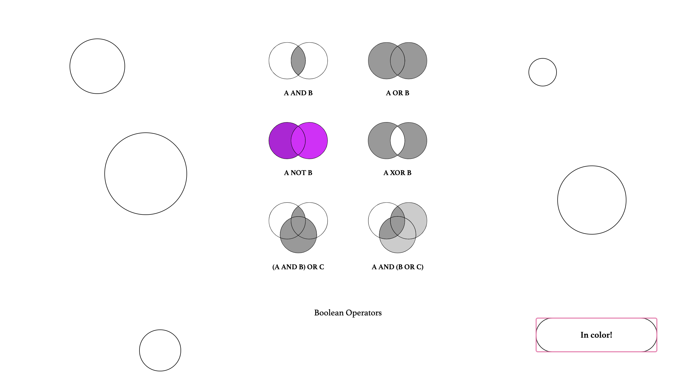
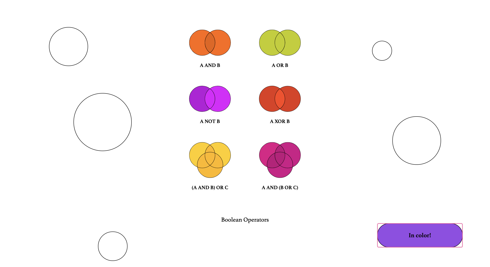
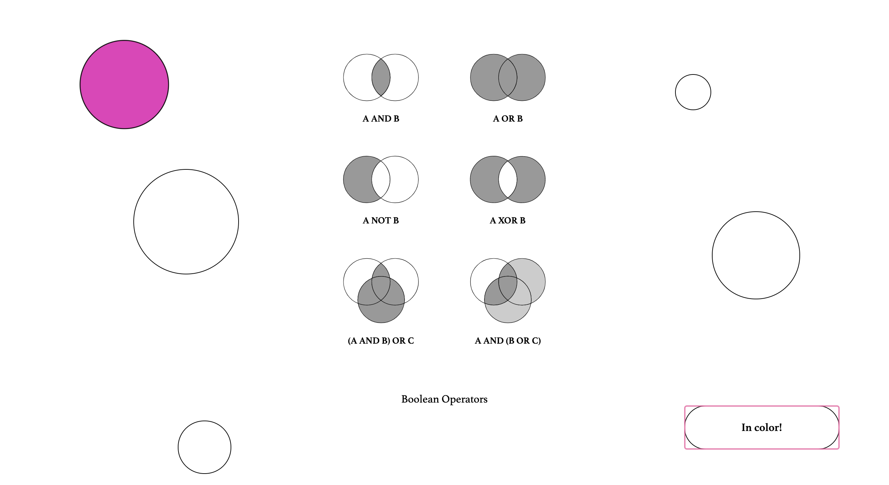
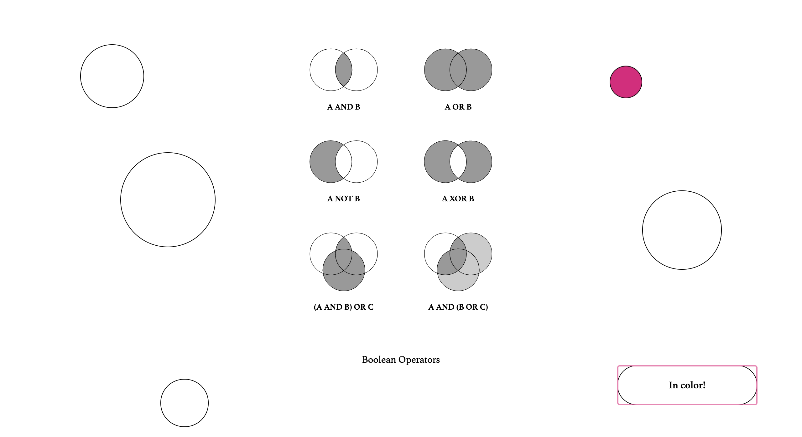

# **WEB ANIMATIE 2020**

## **KUNSTWERK**
Ik heb mijn 'kunstwerk' uit het boekje '500 Graphic Designs That Matter' gehaald. Dit is het design van John Venn. Het is het Venn Diagram Boolean Operators en dateert uit 1880. Ik wist eerst niet wat het was, maar ik had er wel ideetjes bij wat ik ermee kon doen, dus vandaar dat ik 'm heb gekozen. 

  

Na wat onderzoek blijkt het een grafische wiskundige voorstelling van logische relaties tussen meerdere verzamlingen te zijn. Dat klinkt heel ingewikkeld, maar dit maakt het wat duidelijker:

 

Eigenlijk dateert de oorsprong van dit soort diagrammen al uit 1200. Filosoof en logicus Ramon Llull uit Majorca gebruikte toen namelijk al een vergelijkbaar type diagram. Daarna heeft de Duitse wiskundige en filosoof Gottfried Wilhem von Leibnitz óók nog vergelijkbare diagrammen gebruikt aan het eind van de 17e eeuw. In de 18e eeuw vond de Zwitserse wiskundige Leonard Euler het Euler-diagram uit, de meest directe voorloper van het Venn-diagram. John Venn noemden zijn eigen diagrammen aanvankelijk Euler-cirkels en geen venndiagrammen.

## **MIJN IDEE**
Allereerst moest ik het natuurlijk na-maken in Illustrator! 


Omdat het design in zwart-wit (en grijs) is, wou ik natuurlijk wat kleur toevoegen! Mijn idee was om elk diagrammetje een eigen kleur te geven. De kleur komt tevoorschijn met een ```:hover``` en ze krijgen allemaal kleur als je op de knop ```in color```klikt.





Verder heb ik extra cirkels in verschillende grotes toegevoegd. Ieder met een eigen interactie. Ik zal hieronder een paar uitleggen, maar de rest blijft een verassing...
De eerste cirkel wordt groter en kleiner als je eroverheen hovert. Ook verandert hij van kleur.



De tweede cirkel trilt en verandert ook van kleur.



Ik zal alleen verklappen dat er één cirkel is met een speciale verassing...

## **BRONNEN**
* Info over Venn Diagram en afbeeldingen: https://www.lucidchart.com/pages/nl/wat-is-een-venndiagram
* Gekleurde button: https://www.youtube.com/watch?v=FYqUT4nQzPk 
* Center svg: https://www.tutorialspoint.com/Align-HTML5-SVG-to-the-center-of-the-screen
* Hulp: Jorien Korn, Jemiah Sewradj en Roy van Dijk
* Afbeelding boek: https://www.phaidon.com/resource/9780714873848-photo-1.jpg 
* Afbeelding Boolean Operators: https://i.pinimg.com/originals/17/a8/aa/17a8aa62c4bb9da23cd765ce3986bdf0.jpg
* Hulp bij svg: https://css-tricks.com/svg-properties-and-css/#:~:text=There%20are%20many%20Scalable%20Vector,as%20font%2Dsize%20or%20opacity%20.
* Shake transition: https://www.w3schools.com/howto/howto_css_shake_image.asp
* Bounce transition: https://css-tricks.com/making-css-animations-feel-natural/
